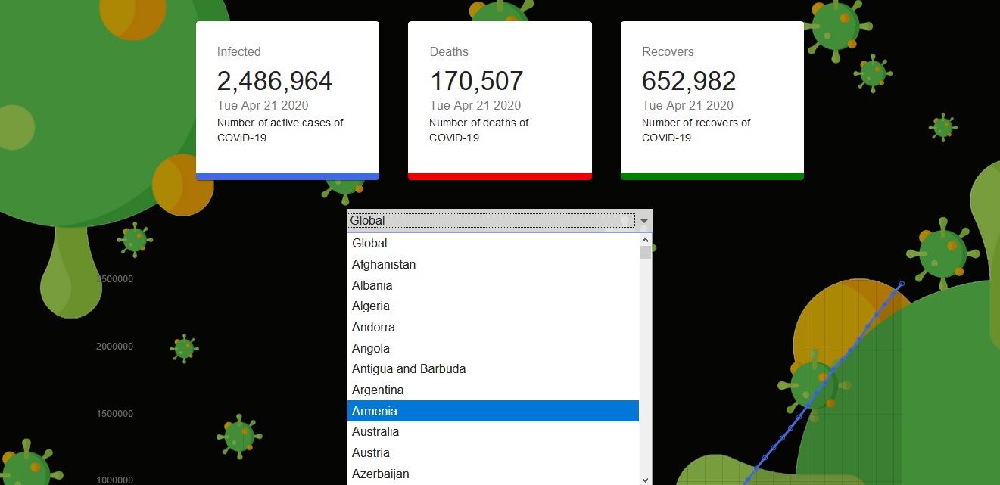
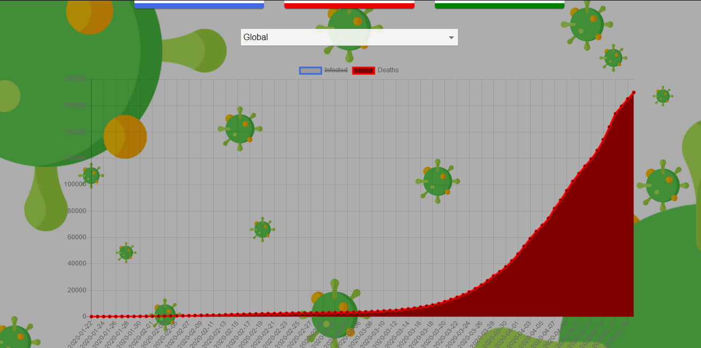

This project was bootstrapped with [Create React App](https://github.com/facebook/create-react-app).

## Used Requires..
  ## Material-UI  -> `yarn add @material-ui/core`
  ## Chart.JS -> `yarn add react-chartjs-2 chart.js`
  ## CountUp -> `yarn add react-countup`
  
## API Reference -> [https://covid19.mathdro.id/api]

## Some Demo Images of this APP...
 
## (1) 
  
## (2) 
  
  
## (3) Dark-Theme Available
  
## (4)
  
